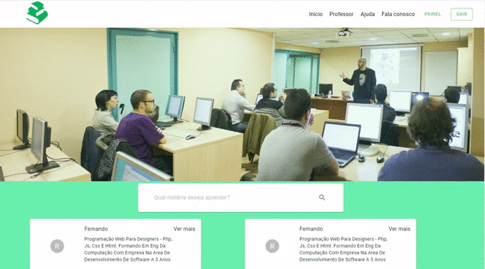
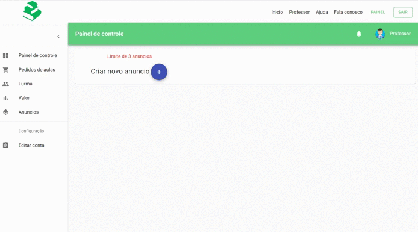
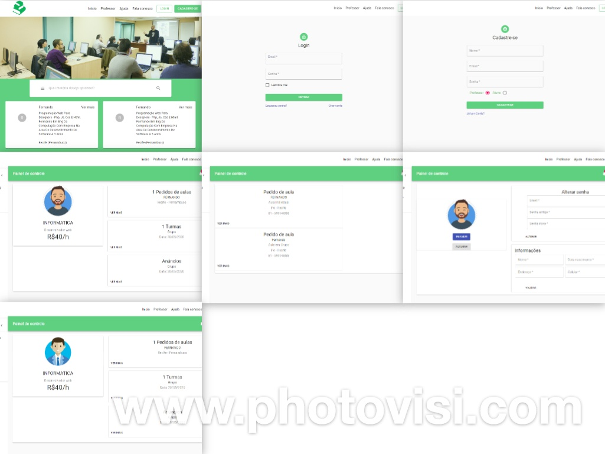

<h1 align="center">
    
</h1>
<h1 align="center">
    
</h1>
<h1 align="center">
    
</h1>
<h1 align="center">
    
</h1>
## Sobre

**PerfectTeacher** é uma plataforma para conectar professores e alunos, foi criado para praticar todo conteúdo estudado. 

---

## Tecnologias

#### Nodejs
- Express
- Multer
- Knex
- Sqlite3
- JWT

#### ReactJs
- Redux
- Redux-saga
- Axios
- React-router-dom
- Material-ui

---

## Como baixar o projeto

```bash
#Clona repositório
$ git clone https://github.com/edpedro/perfecTeacher

#Entra no diretório
$ cd perfecTeacher

#Entra nas pastas Backend/Frontend e instalar dependência 
$ npm install 

#Inicia o projeto
$ npm start

```

---

## Imagens

<h1 align="center">
    
</h1>
---

Desenvolvido por Eduardo Pedro, Edp2013.ep@gmail.com